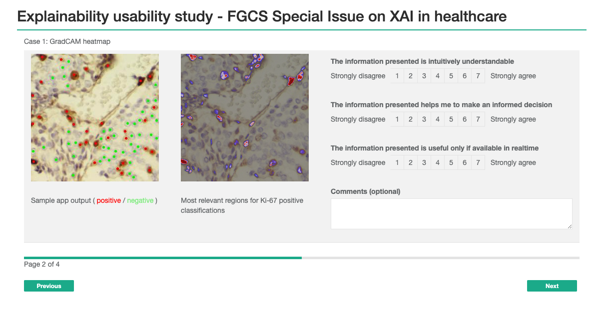

# Usability study for XAI approaches to a sample Ki-67 app

Questionnaire supporting a usability case study for submission to [FGCS Special Issue for Explainable AI in Healthcare](https://www.journals.elsevier.com/future-generation-computer-systems/call-for-papers/explainable-artificial-intelligence-for-healthcare).

## Questionnaire contents:

- User profiling questions, collecting data on familiarity with AI applications in pathology, and with machine learning in general
- 8-10 (TBC) example implementations of explainability methods on a sample Ki-67 app output (some real, some mocked up), with 3 Likert-scale feedback questions to gauge intelligibility, usefulness and importance of timeliness (exact questions TBC)

## Sample screenshot:



Sample Ki-67 model: [PathnoNet](https://github.com/SHIDCenter/PathoNet), trained for 20 epochs on the training set of [SHIDC-B-Ki-67-V1.0](https://shiraz-hidc.com/service/ki-67-dataset/) and demonstrated with the test set of the same dataset.

GradCAM heatmap generated using [Neuroscope-1.0](https://github.com/c3di/neuroscope)

This project was adapted from the [SurveyJS for React quickstart project](https://github.com/surveyjs/surveyjs_react_quickstart.git)

## How to view the survey
```
git clone git@gitlab.cc-asp.fraunhofer.de:empaia/tu-berlin/xai-usability-survey.git
cd surveyjs_react_quickstart
npm i
npm start
```
Open http://localhost:3000/ in your web browser
