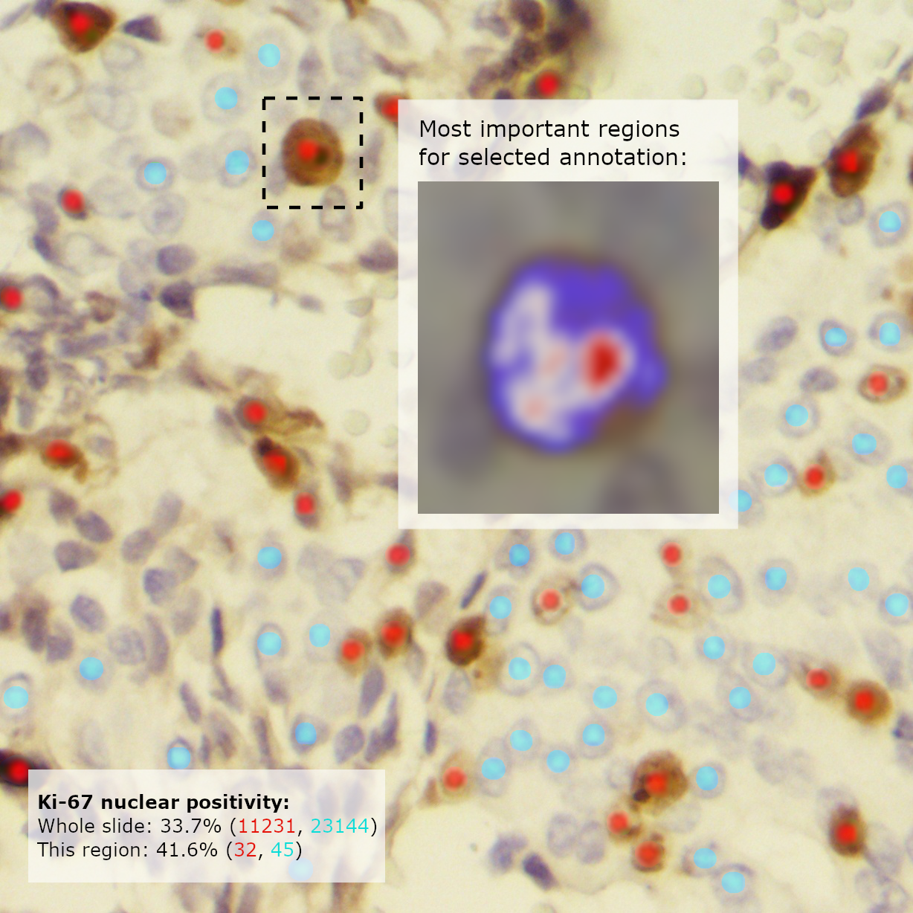
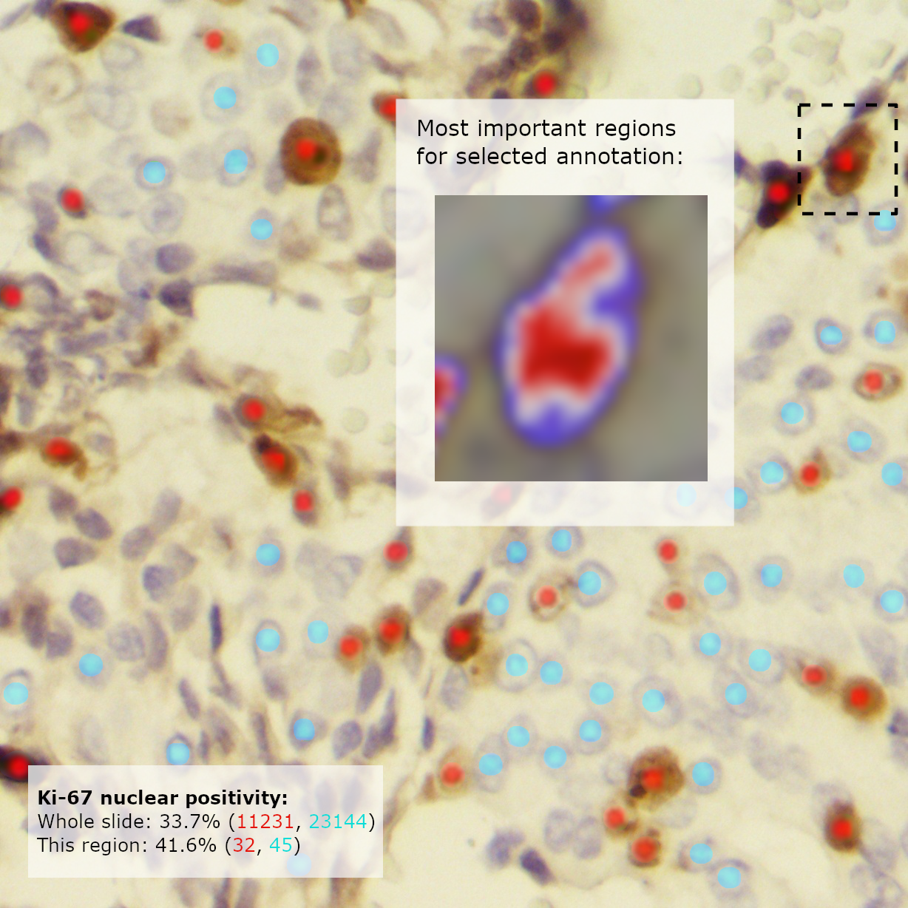
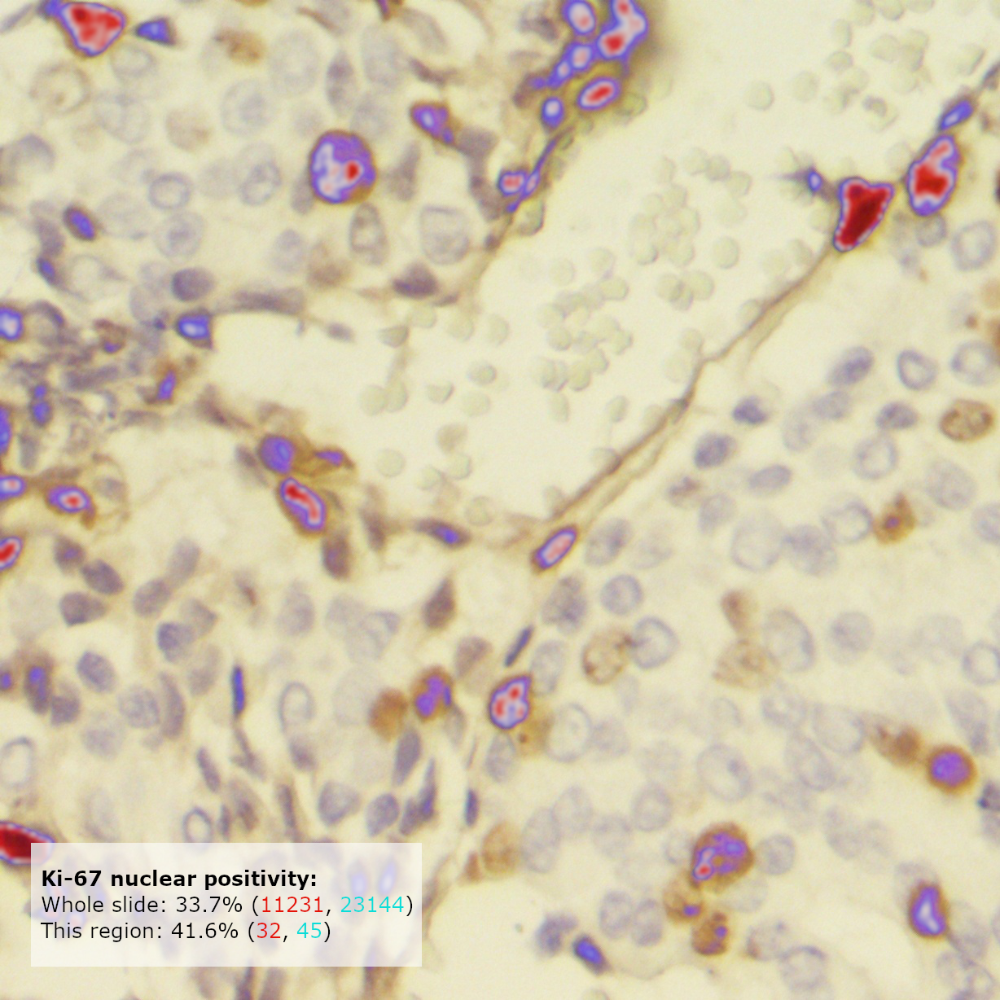
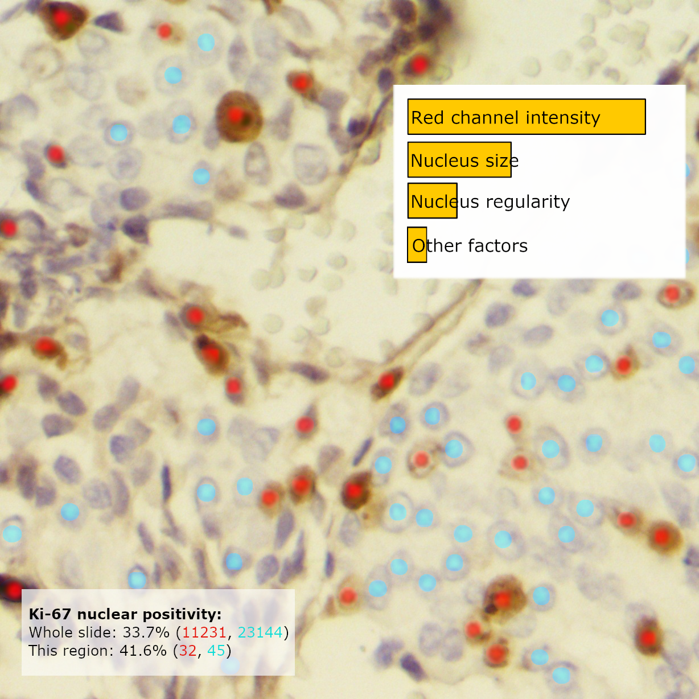
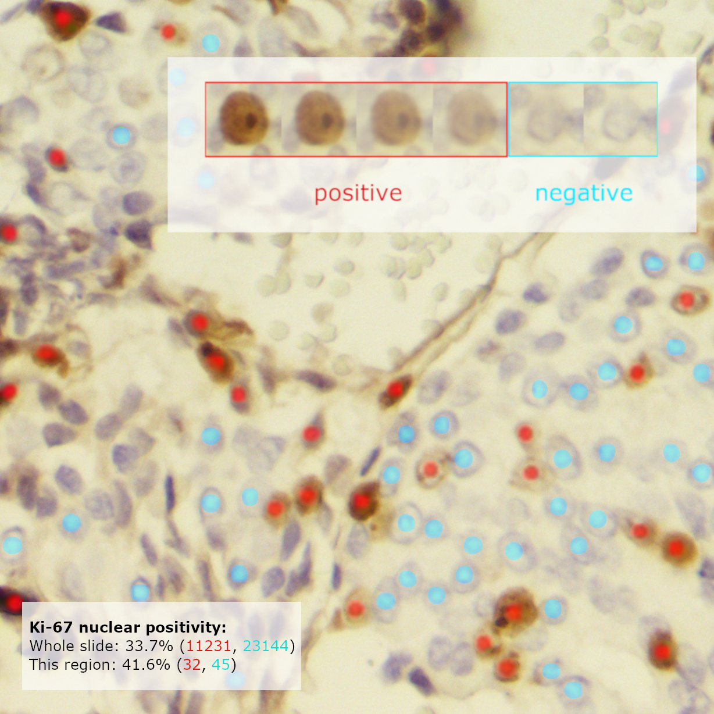

# XAI Survey
# Usability study for XAI approaches to a sample Ki-67 app

Questionnaire supporting a usability case study for submission to [FGCS Special Issue for Explainable AI in Healthcare](https://www.journals.elsevier.com/future-generation-computer-systems/call-for-papers/explainable-artificial-intelligence-for-healthcare).

> Evans, T., Retzlaff, C., Geißler, C., Kargl, M., Plass, M., & Müller, H. et al. (2022). The explainability paradox: Challenges for xAI in digital pathology. Future Generation Computer Systems. doi: [10.1016/j.future.2022.03.009](https://doi.org/10.1016/j.future.2022.03.009)

Questionnaire data analysis is available in the accompanying [Jupyter notebook](/DataProcessing/data_processing.ipynb)

## Questionnaire contents

- User profiling questions, collecting data on usage of and familiarity with AI applications in pathology, and with machine learning in general
- 8-10 (TBC) example implementations of explainability methods on a sample Ki-67 app output (some real, some mocked up), with 3 Likert-scale feedback questions to gauge intelligibility, usefulness and time criticality (exact questions TBC)

## Viewing the survey

```
git clone https://github.com/theodore-evans/xai-in-digital-pathology.git
cd xai-in-digital-pathology/frontend
npm i
npm start
```
Open http://localhost:3000/ in your web browser


## Explanation examples

|    Name    |     Description    |        |  |  |
|------------|--------------------|----------------|-|-|
| Saliency Map (Local) | Show the most relevant pixels for the classification of a selected annotation ||| |
| Saliency Map (Global) | Show the most relevant pixels for the positive classifications within this region of interest ||| |
| Concept Attribution | Show the most important features attributed to positive classifications || | |
| Prototypes | Show prototypical positively and negatively classified annotations within this region || | |
| Counteractuals (One-axis) | Show generated examples interpolating between positive and negative examples, showing model classifications for each || | |
| Counteractuals (Two-axis) | Show generated examples changing in two principal factors of variation, showing model classifications for each || | |
| Trust Scores | Display low-confidence annotations for review || | |


## Additional info

Sample Ki-67 model: [PathnoNet](https://github.com/SHIDCenter/PathoNet), trained for 20 epochs on the training set of [SHIDC-B-Ki-67-V1.0](https://shiraz-hidc.com/service/ki-67-dataset/) and demonstrated with the test set of the same dataset.

GradCAM heatmap generated using [Neuroscope-1.0](https://github.com/c3di/neuroscope)

Example interpolations mocked up using [DiffMorph](https://github.com/volotat/DiffMorph)

All other graphics created with GIMP

This survey is build in React.js using survey.js. The project was adapted from [SurveyJS for React quickstart project](https://github.com/surveyjs/surveyjs_react_quickstart.git)
Public code repo for FGCS Special Issue on xAI in healthcare
